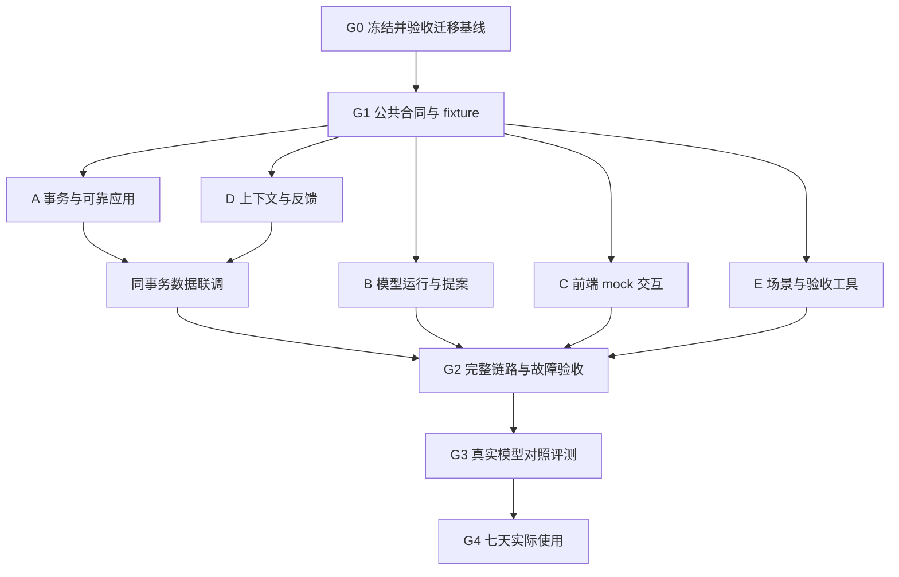

**NewDay Agent MVP 并行开发计划 v2**

编制日期：2026-09-08。状态：G0、G1、G2 已通过；G3 真实模型验收与 G4 七天试用待执行。工程验收、真实模型验收和七天试用分别记录。执行证据与工作线状态见 `docs/agent-development-status.md`。

**1. 当前基线与范围**

本计划依据本次读取到的工作树：`apps/web`（Next.js 16.3.3）、`apps/api`（Fastify + Node SQLite）、`packages/core`。HEAD 为 `f7d8ccf6c7d36f3a7284fa87e082de18df0122b7`，但上述迁移包含大量未提交文件，且编制期间仍观察到文件变化；必须通过 G0 冻结后才能形成可复现的开发基线。上一轮旧结构的 101 个单元测试通过结果不作为新结构验收证据。

已有能力：任务领域校验、每日分组、重复规则、今日重点、事务内批量命令；HTTP strict command schema；SQLite 事务及嵌套 savepoint；PlannerService 串行队列；浏览器历史数据迁移与备份恢复入口。上述能力按现有实现复用，G0 核实其实际运行结果。

仍需增加：当天规划上下文、结构化提案、模型运行记录、提案应用的版本检查与幂等回执、持久决策/结果记录、Agent 交互及评测。现有撤销仍是内存记录和短期窗口；HTTP 错误主要只有文案。

首版产品结果：用户提供当天目标和限制，系统提出 1–3 件现有任务作为重点；必要时澄清；用户采纳或调整后可靠应用；次日能看到当时选择及实际结果，并修正下一次建议。

范围冻结：单用户、本机 Web + API、SQLite 为权威数据源；保持每日清单。Agent 首版唯一业务写能力是设置今日重点的最终集合。任务新增、删除、完成、改期和重复规则仍由现有手动功能承担。关闭页面后的持续调度、远程部署、多用户、外部执行工具及自动推断长期习惯列入后续版本。

**2. G0：先完成基线关卡；规划与评测样例可同时准备**

负责人：集成负责人 I。其余工作线此时可整理接口样例和场景，暂不修改迁移中的公共实现。

| ID | 工作 | 完成标准 |
| --- | --- | --- |
| G0-1 | 核实迁移由谁完成、当前目录与未提交文件；形成单一稳定基线 | 已有迁移在一个可复现快照中，记录 SHA；若暂不提交则记录包含未跟踪文件的快照及内容清单，不将 HEAD 当作工作树版本 |
| G0-2 | 核实 Node >=24、工作区依赖、各包启动与构建 | Web/API 可分别启动，根命令可协调启动；锁文件与安装一致；真实数据目录不进入测试 |
| G0-3 | 运行现有 `pnpm check`、`pnpm build`、`pnpm test:e2e` | 分别记录命令、版本、通过/失败数；修复或明确阻断项，不能沿用旧测试计数 |
| G0-4 | 验证 SQLite 持久化、API 重启、旧浏览器迁移、v1–v4 备份兼容 | 在临时数据库验收；现有用户数据不参与替换导入测试 |
| G0-5 | 修正 README/CONTEXT 中目录、数据位置、Node 版本等滞后描述 | 文档与冻结基线一致；记录当前 E2E 的隔离库/端口机制 |

G0 未通过时，A–E 可以编写规格和 fixture；功能实现的共同起点不得指向不断变化的工作树。当前迁移的剩余工作量未知，不计入后文开发时间估算。

**上一轮审查的四项修订（执行前冻结）**

- I + A + D 统一持久化用户时区的日期来源：默认今日、每日查询、手动重点、完成日期、跨午夜刷新和 Agent 检查共用；历史/未来的显式日期选择保持原义。未配置时区时旧手动清单仍可用，Agent 必须先设置时区。
- I 接入 `tests/agent/unit` 至 Vitest，`tests/agent/integration` 使用 Node + tsx，E 核实发现数量；真实模型评测是独立显式命令，不在 `check` 中调用 provider。
- proposal 的内容 `output.kind` 与 `lifecycle` 分离；ready 仅可一次转为 applied/rejected/superseded/expired。no_change 同样终局；新 operationId 不能重新应用旧提案。历史清理保留执行去重账本，只返回已处理终态及 detailsDeleted。
- E 冻结 12 个开发场景与 40 个保留验收场景（四类各 10），按场景族分离。40 个保留场景各 3 次仍只有 40 个独立场景；查看验收结果后调优会使其转为回归集，不能继续声称未见验收。

**3. G1：冻结公共契约，之后开启五线并行**

负责人 I，A–E 共同审查。公共契约放在拟新增的 `packages/core/src/contracts/agent-planning.ts`，配套 schema 与公共 fixture。Core 保持独立于 Node、React、数据库和模型 SDK；Web 经 HTTP 调用 API。前后端复用同一 schema 和示例。

| 契约 | 必备字段/语义 |
| --- | --- |
| `PlanningVersion` | `datasetEpoch`、`plannerRevision`。实际任务/规则/重点变更增加 revision；替换导入和首次迁移成功产生新 epoch。旧 epoch 的提案不能执行 |
| `DailyContext` | `id`、`revision`、`date`、`timeZone`、当天目标、精力/可承担量、已明确的限制、来源。未提供的信息保持未知，不写成事实 |
| `PlanningSnapshot` | `id`、规划版本、上下文版本、偏好版本、服务器采样时间、可选任务、现有重点、必要的结果历史、提供给模型的上下文范围说明 |
| `AgentRun` | `runId`、去重请求 ID、snapshotId、运行状态、模型/提示词/schema 版本、调用计数、延迟、用量或 unknown、错误码。模型内部思维不作为产品记录 |
| `PlanningProposal` | `proposalId`、runId、snapshotId、`ready / needs_clarification / no_action`；任务 ID、理由及对应事实引用、明确假设；提案本身不写任务 |
| `ApplyProposalRequest` | proposalId、稳定 operationId、预期版本、最终选择的 taskIds。用户调整以该请求中的最终集合为准，保留原建议供比较 |
| `ExecutionReceipt` | operationId、proposalId、`applied / no_change`、前后版本、最终重点集合、增删变化、服务器执行时间、恢复资格。提交成功才能产生成功回执 |
| `PlanningFeedback` | receipt/proposalId、采纳/修改/拒绝、可选原因、反馈 ID、来源、时间。建议采纳和业务执行成功分别记录 |
| `AgentError` | 稳定 code、HTTP status、可展示文案、是否可重试、关联 ID。包括版本冲突、幂等冲突、日期过期、无效输入、模型不可用、结果待确认 |

必须在 G1 一次决定的交互语义：

- 有建议时为 1–3 项；无可执行任务或用户明确休息，返回 `no_action`，不写入，不清空已有重点。
- 采纳表示替换“今日重点最终集合”，预览明确展示新增、保留、移除；一次事务全部完成。普通采纳不接受空集合，清空可继续使用手动入口。
- 仅选择 snapshot 中当前可执行的 open 任务；截止日期/展示范围不自动解释为外部硬承诺。等待他人的任务不能被当作可立即执行工作；硬约束只来自明确输入。
- 明确约束用来源字段保存。当天约束和可编辑的显式偏好分开；旧任务没有约束信息时视为未知。
- 提案只作用于用户配置时区的实际今天，服务器时钟生成执行时间。初始时区由用户设置/浏览器建议后持久化；不得在后台按服务器 UTC 猜“今天”。跨日或变更时区后，旧提案必须重新生成。
- 最多一次澄清轮，最多两个影响选择的问题；已有明确答案不重复问。回答“不知道”可产生标明假设的建议；涉及无法满足的硬约束时停止给出可执行方案。
- 拒绝/编辑建议不自动写任务。用户修改输入、换日或开启新一轮后，旧响应不得覆盖新界面。
- 首版用全局 plannerRevision 做保守冲突检测，不先做细粒度版本优化。上下文/偏好使用独立版本，避免记录反馈本身导致任务提案冲突。
- 候选集合优先使用全部今日可执行任务；固定上下文预算，超出预算显式要求缩小范围或返回不足状态。不得静默截断后宣称已经综合考虑全部任务。
- 执行去重账本与可清理的展示历史分开。首版安装生命周期内保留最小的 operationId、请求摘要、数据集归属和执行终态；用户清理历史时可删除上下文/任务快照，但不能使旧请求重新执行。查到已清理的回执时返回终态及 detailsDeleted，不虚构详情；恢复操作仅在同日、同 epoch 且后续状态允许时可用。
- 独立导入的 run/proposal/receipt 放入来源数据集的只读历史命名空间，不重建可执行 operationId，不仅凭同名 taskId 关联当前任务。导入上下文仅在明确验证任务数据集绑定后才可激活，否则保持只读；导入偏好由用户选择后形成当前版本。导入使全部活动提案失效。

冻结的 HTTP 草案（路径均为计划新增）：

| 入口 | 用途 | 负责人 |
| --- | --- | --- |
| `GET/PUT /api/agent/context/today` | 读取/保存当日上下文，携带版本 | D |
| `GET/PUT /api/agent/preferences` | 读取/修订用户明确表达的偏好 | D |
| `POST /api/agent/runs` | 创建运行，返回 202 + runId；重复请求返回同一运行 | B |
| `GET /api/agent/runs/:id` | 查询状态、澄清问题或提案；支持刷新恢复 | B |
| `POST /api/agent/runs/:id/answer` | 提交一轮澄清答案，去重处理 | B |
| `POST /api/agent/runs/:id/cancel` | 取消未结束运行；晚到响应不得写提案/任务 | B |
| `POST /api/agent/proposals/:id/apply` | 校验提案和最终选择，原子应用 | A |
| `GET /api/agent/operations/:id` | 超时/刷新/重启后确认执行结果 | A |
| `POST /api/agent/operations/:id/revert` | 有条件恢复采纳前的重点集合，另用 operationId 去重 | A |
| `GET /api/agent/history?date=...`、`POST /api/agent/feedback` | 决策结果查询、去重反馈 | D |

模型接入接口：`PlanningModel.generate(snapshot, answers, signal)` 返回严格结构化结果和用量信息；真实 provider 与 scripted fake 实现同一接口。初版运行状态至少覆盖 running、needs_clarification、ready、no_action、failed、cancelled、interrupted。API 重启使未完成推理标为 interrupted，用户可新建一轮；不承诺自动续跑或模型计费恰好一次。

G1 交付：可导入的 schema/types、成功/澄清/无动作/冲突/结果未知 fixture、状态转换表、任务分配与共享文件所有权。所有工作线通过相同合同测试，才开始各自实现。

**4. 五条并行工作线与任务拆分**

配置：I 集成负责人 + A/B/C/D/E 五名执行者，共六个并发角色。G0 另有迁移执行者时，最多七个；不把同一个任务拆成必须同时修改公共文件的两份。

| 工作线 | 独占范围 | 依赖 |
| --- | --- | --- |
| A 可靠执行与存储底座 | 现有 SQLitePlannerStore、PlannerService、planner HTTP 层；core command/undo；新增 transaction、execution、schema migrations | G1；给 D/B 提供事务与仓储 fake |
| B 模型运行与提案 | `apps/api/src/agent/`、agent-run-service、agent-run-routes、run 仓储适配及测试 | G1 即可用 fake 开始；真实快照等 D1，持久化等 A1 |
| C 前端体验 | `apps/web/src/features/agent/{api,hooks,components}/` 及邻近测试 | G1 后依赖 mock；真实接线等 A/B/D |
| D 上下文与反馈 | planner-context/history/preferences services、相应 repository/routes/tests | G1 后先纯逻辑和 fake；A1 后同事务持久化 |
| E 评测与跨层验收 | `tests/agent/`、`tests/e2e/agent-*.spec.ts`、评测 fixtures/报告工具 | G1 后设计并实现；各实现合入后运行 |
| I 合同与集成 | core 新公共 contracts/domain、app.ts/config、根脚本/依赖锁文件、现有 Web 接入点、共享 E2E fixture、文档 | 接收每线的小批次交付 |

I 独占现有 `day-planner.tsx` / `use-day-planner.ts` 的挂载修改，以及通用 HTTP 请求器的提取；C 提供组件与回调合同。SQLite schema 只有 A 一名所有者，B/D 提供表定义需求后由 A 加入统一迁移。所有 provider 依赖及新脚本由 I 汇总修改，其他人不并行更新锁文件。

**A：可靠执行与存储底座**

- A1：在现有单连接 SQLite 上提供受控事务上下文、迁移机制、版本、执行回执与事件写入能力。B/D 仓储使用传入的同一事务，不能另开连接拼成“看起来原子”的操作。交付真实/内存实现及失败注入接口。
- A2：统一人工 commands、undo、restore、migrate 和每日查询中的重复实例生成。实际变更使 revision 增加一次；只读/no-op 不增加。快照在补齐重复实例之后一致读取。
- A3：实现提案应用：验证 snapshot、日期、上下文/偏好版本、任务状态和最终集合；在同一事务处理去重、重点集合、revision、事件、采纳结果、持久回执。相同 operationId 同请求返回原回执；不同输入返回幂等冲突。
- A4：结果查询与恢复。提交响应丢失后读原 operationId；恢复仅还原该次重点集合，检查当前日期、epoch、后续重点修改及任务状态，冲突时不覆盖用户修改。恢复本身也是一次新操作和事件。
- A5：协调现有短时撤销与新持久记录。core 当前在内层事务返回后发布/消费内存 undo；嵌套 savepoint 不代表最外层已经提交。将发布、清理和消费等内存副作用延迟到最外层 COMMIT 后；失败不能出现幽灵回执或丢掉有效撤销。
- A6：保持任务备份 v4 定义；恢复成功换 epoch，旧提案/恢复资格失效，旧回执可只读查询且标明所属旧数据集，不重新执行。恢复失败原状态保持。已有浏览器迁移标记的防覆盖语义继续保留。

A 验收：重复提交、同键异请求、手动编辑后采纳、并发两个采纳、重复物化变更、日志失败全回滚、提交前/后进程中断、重启查回执、恢复冲突、导入后旧提案，均有临时 SQLite 集成测试。已有事务和 HTTP schema 不重复建设。

**B：模型运行与提案**

- B1：实现可替换 provider、scripted fake、固定版本提示词与严格输出解析。只返回建议/问题，不让模型任意生成并执行 PlannerCommand；时间和 ID 由宿主产生。
- B2：构建受控运行：持久化 run → 获取 snapshot → 事务/PlannerService 队列外调用模型 → 校验候选引用和约束 → 保存提案/问题。保存提案不宣称它到应用时仍有效，A 负责最终检查。
- B3：支持一次澄清、取消、重复请求去重、刷新读取以及启动后的 interrupted 标记。单用户首版最多一条活动推理；旧调用迟到不能覆盖新运行。
- B4：初始可配置限制：每次模型请求 30 秒；每个 run 最多 3 次模型调用，包含澄清续轮和最多一次格式修复；禁止无限重试。上述为工程默认值，G3 根据所选 provider 结果校准。调用发生在任务数据锁外。
- B5：接入一个明确 provider，记录实际模型 ID、提示词/schema 版本、用量/延迟；未知用量不按 0 计算。密钥仅 API 环境持有，传给模型的字段范围明确，备注内容作为数据处理。真实调用前落实 provider 配置、数据范围与费用上限。

B 验收：假任务 ID、重复任务、超三项、越权动作、把备注指令当系统指令、伪造硬截止、畸形输出、429/超时/取消/重启均得到有界结果且零业务写入。慢模型期间手动任务操作仍可完成。

**C：前端体验**

- C1：在现有每日列表增加“帮我定今日重点”入口、可选的当天目标/负担输入；未配置模型、API 不可用、旧数据迁移中均有准确状态。
- C2：实现建议卡：理由、事实来源、假设；明确问题的澄清表单；无任务/休息的 no_action；拒绝与调整。用户能够保持已有手动工作方式。
- C3：实现最终集合预览，展示新增/保留/移除；采纳后依据成功回执刷新清单。避免请求发出即显示成功或提前修改真实任务。
- C4：实现冲突提示、跨日失效、结果待确认。提交超时后查询原 operationId，禁止新建 ID 盲重试；刷新可恢复当前 run/操作记录，不能依赖现有模块内 clientId 作为持久身份。
- C5：实现当日决策记录、次日反馈和恢复入口；原因可跳过，偏好可编辑；旧 epoch 记录只读展示。保留键盘、焦点、窄屏和亮暗模式体验。

C 验收：使用同合同 AgentApi fake 和可控 Promise 覆盖全状态；日期切换/新请求的晚响应被忽略；采纳前后 diff 准确；结果未知与失败呈现不同；Chrome/WebKit 的完整用户旅程交由 E/I 验证。

**D：当天上下文、决策历史与反馈**

- D1：构建一致的 PlanningSnapshot。今日可执行任务、现有重点、用户上下文和必要历史带来源/版本；未填写的精力、硬截止、阻塞信息保持未知；未来任务仅作背景时明确不可直接成为今日重点。
- D2：实现上下文/显式偏好存取与修订；当天约束不自动变成长久偏好。来自自然语言的约束若存在歧义，通过提案假设/澄清展示，不静默写入长期事实。
- D3：保存原建议、用户最终选择、采纳/拒绝/修改和执行回执关联。成功应用事件由 A 的同一事务产生；B/D 不另补一条可能失真的“已执行”。
- D4：从首次接入后的完成、重新打开、改期、删除、恢复事件构建当日结果；保存重点采纳时的快照，即使当前 focus 被删除也能回看。历史缺失标为 unknown，不伪造接入前行为。
- D5：提供次日反馈与有来源的最近记录给下一次 run。显式偏好可编辑/删除；关闭学习、清除 Agent 上下文/历史不影响任务数据，同时使引用已删除上下文的未执行提案失效。
- D6：Agent 数据备份策略：任务 JSON v4 继续只含任务/规则/重点；增加独立版本化 Agent 数据导出/恢复，声明范围，排除密钥。恢复不得重放执行请求，恢复后生成新 epoch/使活动提案失效；遵守 G1 的账本保留、来源命名空间和上下文激活规则。文件格式由 I 冻结，SQLite 迁移/原子替换由 A 完成。

D 验收：采纳后完成/改期/重开/删除仍可追溯；重复反馈不会双计；事件事务失败不产生成功历史；未知原因不变成偏好；清理/导入后不使用旧上下文；Agent 数据导出恢复往返一致，操作回执仅作为历史。

**E：评测与验收**

- E1：G1 即冻结至少 40 个固定场景的输入、期望约束及人工评分准则，不先根据模型输出修改答案；正常取舍 10、日期/约束/阻塞 10、澄清/偏好/无动作 10、模型异常/不可信备注 10。
- E2：建立无模型的合同与跨层测试；执行可靠性故障用例独立于 40 个模型场景。对最终数据库状态、版本、事件数量和回执做确定性断言。
- E3：与 A/B/C 联调真实 HTTP + 临时 SQLite + scripted fake。验证模型等待不阻塞人工操作；完成→重开→反馈、导入→旧提案拒绝、跨日和多标签并发等链路。
- E4：集成负责人准备独立数据库生命周期；新表不能依赖旧 v4 空备份清理。既有 E2E 是服务端共享库、当前串行；首版保留该机制并严格隔离，扩并行时每 worker 使用独立 API/数据库。
- E5：真实模型评测使用同一快照/提示词版本/模型 ID，40 场景各 3 次，至少 120 次 trial；记录每次终态及成本/延迟。对照现有日期排序和遵守相同显式约束的简单规则基线。模型生成漂亮理由不等于完成。
- E6：七天真实试用，收集每日定重点耗时、采纳后修改数、用户认为重要事项是否推进、错误变更和无效打扰。提前取得人工基线；没有历史记录时增加至少 3 天人工基线采集，不能将回忆估计包装为实测。

E 的用例输出不替代 A–D 自己的模块测试。E 负责独立验收、回归场景和证据汇总。

**5. 并行波次、关键路径与时间估算**

以下是 G0 稳定后、五条工作线持续有人承担的工程估算；不是对当前迁移剩余时间或模型效果的承诺。按实际交付关卡推进，模型调优和新发现缺陷可能延长。

| 波次 | I | A | B | C | D | E |
| --- | --- | --- | --- | --- | --- | --- |
| W0：约 1 天 | G1 合同、状态、fixture、所有权冻结 | 事务/版本设计审查 | 模型输入输出审查 | 用户旅程审查 | 快照/事件审查 | 验收标准与固定场景 |
| W1：约 2–3 天 | 依赖/路由/公共 HTTP 接入 | A1–A2 存储/事务/版本 | B1–B2 fake + 提案运行 | C1–C2 mock 界面 | D1–D2 pure/fake 快照与上下文 | E1–E2 场景及合同测试 |
| W2：约 2–3 天 | 小批次集成、schema 协调 | A3–A6 应用/恢复/故障 | B3–B5 provider/恢复/限额 | C3–C5 预览/恢复/反馈 | D3–D6 持久历史/反馈/导出 | E3–E4 跨层和 E2E |
| W3：约 1–2 天 | G2 集成验收与文档 | 修复执行链缺陷 | 修复模型运行缺陷 | 修复交互缺陷 | 修复历史一致性缺陷 | 全回归、故障注入、构建 |
| W4：约 1–2 天 | 固定真实模型配置并作 G3 判断 | 必要修复 | 真实模型评测与有版本调优 | 用户试用准备 | 指标核对 | E5 与基线对照 |

总计：G0 之外预计约 7–11 个工程工作日形成经过真实模型评测的候选版；之后至少 7 个自然日个人试用。若没有人工基线，额外采集至少 3 天；尽量在开发期间并行完成，不压缩七天 Agent 试用。

关键路径通常是 G0 → G1 → A1/A2 → A3 与 D3 同事务联调 → C3/E3 完整链路 → G2 → G3。B 若真实模型质量不达标，会成为另一条关键路径。C/E 可以先依赖合同与 fake，不等待 A/B 写完才开始。

**6. 验收关卡与停止条件**

| 关卡 | 必须满足的证据 | 不满足时的处理 |
| --- | --- | --- |
| G0 基线 | 新结构 check/build/E2E、持久化与迁移证据 | 收敛基础迁移；规格工作可继续 |
| G1 可并行合同 | 相同 schema/fixture；各状态、日期、版本、幂等与恢复语义无歧义 | 先改合同，不让每条线自行猜实现 |
| G2 软件闭环 | 全模块/架构/API/E2E 通过；故障注入无重复写、部分提交、幽灵回执或静默覆盖；模型故障不损害手工规划 | 仅作为开发版，继续修复 |
| G3 模型候选版 | 至少 120 trials 的原始记录；结构化有效结果比例目标 >=95%；不出现未拦截的无效任务/越权写；硬约束案例经人工复核；相对规则基线有可解释优势 | 若只增加复杂度或需要持续纠正，收缩模型职责或改进后重测 |
| G4 个人可用 | 七天实用记录；错误/未经确认变更为 0；至少 5 天能完成规划闭环；相对实测人工基线的每日规划耗时中位数下降目标 >=20%，且重要事项推进评分不下降 | 定位输入负担、建议质量、可靠性或打扰问题，不以完成率一项宣布成功 |

G3 的格式有效不等于建议有用；运行时拦截违规不等于模型从不犯错，分别报告。G4 数值是首版建议目标，应在收集结果前冻结；七天单人样本只支持个人试用判断，不能证明普遍有效。若基线每天已接近零规划时间，可在试用开始前改为预定义的负担评分目标，不事后换指标。

预算未知时仍可完成 G2。真实 provider 的选型、数据发送范围和费用上限只影响 G3；本次计划不发起真实模型请求。后续远程部署、关闭页面后的主动执行和外部工具操作单独建立验收范围。

**7. 集成与交付纪律**

- G0 后以共同基线创建各工作线的 `codex/agent-*` 分支/隔离工作树；当前未提交迁移不能仅靠从 HEAD 建分支复制。禁止覆盖他人变更。
- 每个任务按交付物小批次集成。公共合同改动由 I 发布版本变更，关联修改与回归一起合入；不能临时在调用方绕过 schema。
- 各线交付记录任务 ID、SHA、涉及文件、合同版本、运行命令与结果、已知缺口。I 负责合并后的整体验证，分支各自通过不能替代集成验证。
- 测试只使用内存/临时 SQLite 和隔离端口，不读取或替换真实 `data/newday.sqlite`；运行数据库拷贝使用 SQLite 一致性备份方法，不能直接忽略 WAL 复制主文件。
- 关闭 Agent 功能开关后，已有手动任务功能可用。迁移采取增量方式；回滚应用代码不自动回退数据库格式，必要时用已验证备份恢复。
- Next.js 代码实现前，从 `apps/web` 实际安装的 Next 包读取 `dist/docs/` 中对应说明；本计划不假设其他版本的 API。模型调用放在现有 Fastify API 进程中，不另建一套 Next 业务写路径。

最终交付：可运行候选版、迁移与数据导出说明、Agent 配置示例、单元/合同/SQLite/API/E2E 记录、真实模型评测报告、七天个人试用报告，以及尚未纳入首版的后续清单。
