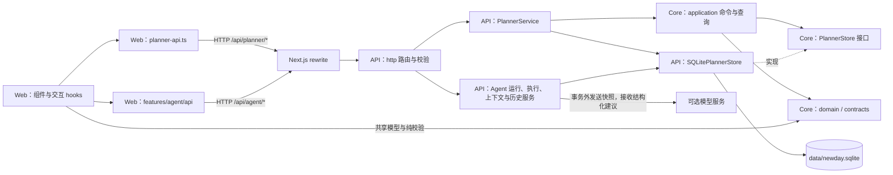

# NewDay 架构与目录职责

NewDay 使用 pnpm workspace 管理三个工作区：`@newday/web`、`@newday/api`、`@newday/core`。前端和后端是独立进程，SQLite 是任务的权威存储。业务规则复用在 core 中，业务执行发生在 API 进程。

## 请求与数据流



浏览器通过 [planner-api.ts](../apps/web/src/features/planner/api/planner-api.ts) 发起同源请求；[Next 配置](../apps/web/next.config.ts) 把 `/api/:path*` 转发给独立 API。`apps/web/src/app` 只提供页面、布局与错误边界，没有业务 API，也不连接 SQLite。

规划交互使用 [agent-api.ts](../apps/web/src/features/agent/api/agent-api.ts)，与手动清单共用 [HTTP 请求器](../apps/web/src/shared/http/request.ts)。模型只返回结构化建议或问题，不拿到 Store，不生成可执行的 `PlannerCommand`。采纳由独立的 `AgentExecutionService` 验证并执行；任务新增、完成、删除、改期和重复规则继续走人工命令。

前端 hook 管理页面选择、加载、失败提示和刷新。操作成功后重新读取后端数据；页面重新获得焦点或可见时刷新，可见页面也会每 15 秒刷新。日期切换会中止旧请求，避免旧响应覆盖当前日期。后端不可达时显示错误并允许重试，没有本地任务写入或断网后自动补交队列。

Agent 界面在确认前预览新增、保留、移除的重点，收到成功执行回执后才刷新任务。结果未知时保留原请求，并查询原 `operationId`；不能换 ID 盲重试。运行和操作的恢复标识、精确待确认请求保存在 `sessionStorage`，范围是同一标签页的刷新恢复，不保证关闭标签页后的恢复。权威快照、运行、提案和执行记录始终来自 API。

## 目录职责

| 目录 | 负责 | 依赖边界 |
| --- | --- | --- |
| [`apps/web/src/app`](../apps/web/src/app) | Next 路由入口、字体、布局、错误边界 | 组合前端功能，不执行任务命令 |
| [`features/planner/components`](../apps/web/src/features/planner/components) | 日期导航、时钟、任务列表、编辑器和状态提示 | 接收状态与事件，调用前端 hooks |
| [`features/planner/hooks`](../apps/web/src/features/planner/hooks) | 页面状态、交互编排、HTTP 数据加载与刷新 | 经 `api/` 调用后端，不创建 Store |
| [`features/planner/api`](../apps/web/src/features/planner/api) | HTTP 路径、请求序列化、超时和错误转换 | core application 仅允许类型导入 |
| [`features/planner/lib`](../apps/web/src/features/planner/lib) | 展示格式、浏览器 JSON 下载 | 不执行业务命令，不写任务存储 |
| [`features/planner/migration`](../apps/web/src/features/planner/migration) | 读取旧 IndexedDB、请求迁移、备份后清理旧库 | 旧库读取与明确清理分开；新任务仍走 API |
| [`features/agent`](../apps/web/src/features/agent) | 当天输入、建议与来源、澄清、最终集合预览、待确认结果、历史反馈与偏好 | `api` 调 HTTP；controller 管理请求身份与过期响应；components 呈现状态 |
| [`shared/http`](../apps/web/src/shared/http) | 共享 HTTP 请求、超时与错误转换 | 不执行领域命令，不存储任务 |
| [`features/theme`](../apps/web/src/features/theme) | 主题偏好、主题切换和首屏 bootstrap | 仅主题使用浏览器 localStorage；bootstrap 可由布局引用 |
| [`apps/web/src/styles`](../apps/web/src/styles) | 全局样式与页面视觉 | 不包含业务状态 |
| [`apps/api/src/http`](../apps/api/src/http) | 路由、参数/body/header 校验、HTTP 错误 | 调用 service，不直接改数据库 |
| [`apps/api/src/services`](../apps/api/src/services) | 人工命令、Agent 运行与应用、当天上下文、显式偏好、历史及独立备份编排 | 共享同一个 Store；模型等待不占数据库事务 |
| [`apps/api/src/agent`](../apps/api/src/agent) | 模型接口、固定版本提示词、结构化输出与引用校验、provider 和 scripted fake | 只产生数据；不持有业务写入能力 |
| [`apps/api/src/storage`](../apps/api/src/storage) | SQLite schema、索引、单连接事务、版本、事件、Agent records、执行账本和迁移标记 | 实现 core 存储接口，不依赖 http/routes/services |
| [`packages/core/src/domain`](../packages/core/src/domain) | Task、重复规则、日期运算及 Zod 领域约束 | 不依赖 application、任何 app 或运行环境 |
| [`packages/core/src/application`](../packages/core/src/application) | 命令、每日查询、重复实例生成、撤销、备份恢复和 Store 接口 | 依赖 domain/contracts，通过 Store 接口读写 |
| [`packages/core/src/contracts`](../packages/core/src/contracts) | 任务备份、Agent 规划和独立 Agent 备份的 schema/types | 可由前后端共同使用，不连接数据库或模型服务 |
| [`tests`](../tests) | 领域/应用单元测试、前端测试、存储替身、架构检查、浏览器 E2E | 测试可引用生产代码；生产代码不得反向依赖测试 |
| [`apps/api/tests`](../apps/api/tests) | HTTP 集成、真实 SQLite 事务与重启持久化 | 使用临时数据库或内存数据库 |
| [`tooling`](../tooling) | 开发/生产双服务启动器、ESLint 边界规则 | 项目工具，不进入应用运行时 |

`apps/api/src/app.ts` 负责创建 Fastify、Store、Service 并接入路由与统一错误处理；`server.ts` 负责监听及进程退出；`config.ts` 负责读取和校验环境配置。

规划服务分工：`PlannerContextService` 生成一致快照，`PlannerPreferencesService` 管理明确偏好与时区，`AgentRunService` 管理模型运行和澄清，`AgentExecutionService` 原子应用或恢复重点，`PlannerHistoryService` 管理反馈、每日结果、历史清理和独立备份。它们复用 `SQLitePlannerStore.transaction()`，没有另开连接拼接事务。

## 依赖规则

规则定义在 [architecture.mjs](../tooling/eslint/architecture.mjs)，由根 ESLint 配置加载，行为由 [边界测试](../tests/architecture/import-boundaries.test.ts) 验证：

- Web 和 API 不直接相互导入，通过 HTTP 协作。
- Web 可以在运行时使用 core domain/contracts；core application 必须使用 `import type` 或其他纯类型导入。旧数据迁移也不例外。
- Core 不引入 React、Next、Dexie、Node 内置模块或浏览器全局变量；domain 不反向依赖 application。
- API 不引入 Web、React、Next 或 Dexie；storage 不引入 http、routes 或 services。
- 生产代码不引入测试文件或测试工具。

规则同时解析 `@/`、`@newday/core/*`、工作区别名和相对路径，并检查静态导入、动态导入、类型导入与 re-export。目录改名或路径写法变化不能替代依赖方向设计。

## 修改功能时从哪里开始

| 需要修改 | 主要入口 |
| --- | --- |
| 清单布局、日期导航、任务行 | [day-planner.tsx](../apps/web/src/features/planner/components/day-planner.tsx)、[task-list.tsx](../apps/web/src/features/planner/components/task-list.tsx)、[globals.css](../apps/web/src/styles/globals.css) |
| 编辑器字段与前端交互状态 | [task-editor.tsx](../apps/web/src/features/planner/components/task-editor.tsx)、[use-day-planner.ts](../apps/web/src/features/planner/hooks/use-day-planner.ts) |
| 加载、重试、刷新和切换日期 | [use-planner-data.ts](../apps/web/src/features/planner/hooks/use-planner-data.ts) |
| HTTP 客户端路径、超时或错误提示 | [planner-api.ts](../apps/web/src/features/planner/api/planner-api.ts) |
| 新增接口或修改请求校验 | [planner-routes.ts](../apps/api/src/http/planner-routes.ts)、[planner-schemas.ts](../apps/api/src/http/planner-schemas.ts) |
| API 请求编排、撤销归属和有效期 | [planner-service.ts](../apps/api/src/services/planner-service.ts) |
| Agent 公共合同、状态、请求与响应 | [agent-planning.ts](../packages/core/src/contracts/agent-planning.ts) |
| Agent 运行、取消、澄清与模型等待 | [agent-run-service.ts](../apps/api/src/services/agent-run-service.ts)、[agent](../apps/api/src/agent) |
| Agent 原子采纳、幂等查询与条件恢复 | [agent-execution-service.ts](../apps/api/src/services/agent-execution-service.ts) |
| 当天快照、偏好、反馈、每日结果与 Agent 备份 | [planner-context-service.ts](../apps/api/src/services/planner-context-service.ts)、[planner-preferences-service.ts](../apps/api/src/services/planner-preferences-service.ts)、[planner-history-service.ts](../apps/api/src/services/planner-history-service.ts) |
| Agent 前端状态与建议界面 | [agent-controller.ts](../apps/web/src/features/agent/hooks/agent-controller.ts)、[agent-planner.tsx](../apps/web/src/features/agent/components/agent-planner.tsx) |
| 任务命令、重复规则变更、重点限制 | [planner-command.ts](../packages/core/src/application/planner-command.ts)、[planner-model.ts](../packages/core/src/domain/planner-model.ts) |
| 每日分组、逾期投影、实例生成 | [day-plan.ts](../packages/core/src/application/day-plan.ts)、[recurrence-generation.ts](../packages/core/src/application/recurrence-generation.ts) |
| 持久化、数据库 schema 或索引 | [sqlite-planner-store.ts](../apps/api/src/storage/sqlite-planner-store.ts)；需要新能力时同步修改 [PlannerStore](../packages/core/src/application/planner-store.ts) |
| 备份格式与旧版本兼容 | [contracts/planner-backup.ts](../packages/core/src/contracts/planner-backup.ts)；读取/恢复存储在 [application/planner-backup.ts](../packages/core/src/application/planner-backup.ts) |

增加任务命令时，同时维护 core 命令类型/业务处理、HTTP Zod schema、前端调用和相应测试。请求校验负责输入是否合法，core 负责业务状态是否允许该操作，storage 负责原子提交与数据库约束。

## HTTP API

请求从 Web 的 `/api` 进入，也可由本机工具访问 API 端口。成功响应直接返回下表中的 JSON。手动接口错误保留 `{ "message": "可展示的错误说明" }`；Agent 业务错误另外提供稳定的 `code`、`status`、`retryable` 和可选 `correlationId`。通用来源、媒体类型、请求体大小等 HTTP 错误仍可只有 `message`。修改请求使用 `Content-Type: application/json`；人工 `commands` 和 `undo` 还必须携带 `x-newday-client`，当前前端为每个页面运行实例生成随机标识。Agent 依靠稳定请求 ID 和 operation ID 去重。

| 方法与路径 | 输入 | 成功响应 |
| --- | --- | --- |
| `GET /api/health` | 无 | `{ "status": "ok" }` |
| `GET /api/planner/day` | query：`selectedDate`、`asOfDate`，格式 `YYYY-MM-DD` | `DayPlan`：所选日、实际当天、focus/overdue/open/completed 分组及 counts |
| `GET /api/planner/series/:id` | 重复规则段 ID | `RecurrenceSeries`，不存在时为 `null` |
| `POST /api/planner/commands` | `{ commands: PlannerCommand[] }`，1–100 项 | `{ receipt: { token } }` 或 `{ receipt: null }` |
| `POST /api/planner/undo` | `{ receipt: { token } }` | `{ ok: true }` |
| `GET /api/planner/backup` | 无 | 版本 6 的完整 `PlannerBackup`，含生活管理集合及无凭据的 Notion 同步元数据 |
| `POST /api/planner/backup` | `{ source: "备份 JSON 字符串" }` | `{ ok: true }`，原子替换全部规划数据 |
| `POST /api/planner/stop-preview` | `{ seriesId, endDate }` | 普通实例、重点记录、保留实例、后续规则段数量和 `revision` |
| `POST /api/planner/migrate` | `{ source: "旧浏览器备份 JSON 字符串" }` | `{ status: "imported" \| "already-imported" \| "server-not-empty" }` |

生活管理接口由 `life-routes.ts` 校验输入，`LifeService` 在 SQLite 事务中执行。`GET /api/life/workspace` 返回收集箱、两级文件夹、资料、资料任务关联和与“今天”共用的任务记录。`POST /api/life/inbox` 收集条目；`POST /api/life/inbox/:id/task` 和 `.../resource` 显式分流并移出收集箱；`.../discard` 丢弃条目。`POST /api/life/folders`、`.../:id/rename` 管理文件夹；`POST /api/life/resources`、`.../:id/update` 保存和移动资料；`POST /api/life/resources/:id/links` 及 `.../:taskId/remove` 管理关联。任务分流调用共享规划命令，资料与任务关联在同一事务提交。

`day` 读取前会在后端生成截至实际当天之后 31 天的重复实例，并确保所选日期的实例存在，因此这个查询可能产生后端存储写入。停止重复先获取预览，提交命令时附带预览结果，服务端拒绝已经过时的影响范围。

保存规划时区后，API 根据该 IANA 时区和服务器时钟确定实际今天：每日查询的 `asOfDate`、人工完成日期及今日重点与 Agent 共用这一来源。浏览器仍提交 `selectedDate` 选择查看哪一天；未设置时区前，人工接口保留原来的浏览器日期输入行为，Agent 生成返回 `TIME_ZONE_REQUIRED`。

### Agent API

完整字段和 strict schema 见 [公共合同](../packages/core/src/contracts/agent-planning.ts)。这些接口与手动规划共用 API 进程和 SQLite。

| 方法与路径 | 输入 | 成功响应 |
| --- | --- | --- |
| `GET /api/agent/status` | 无 | `{ configured, modelId, today, timeZone }`；时区未设置时后两项为 `null` |
| `GET /api/agent/preferences` | 无 | `AgentPreferences`；首次读取 `timeZone: null` |
| `PUT /api/agent/preferences` | `{ expectedRevision, timeZone, learningEnabled, explicitPreferences }` | 保存后的 `AgentPreferences` |
| `GET /api/agent/context/today` | 无；要求已保存时区 | `{ context: DailyContext, version: PlanningVersion }` |
| `PUT /api/agent/context/today` | `{ expectedRevision, goals, energy, capacity, constraints }` | `{ context, version }`；未知精力和容量为 `null` |
| `POST /api/agent/runs` | `{ requestId }` | `202` + `{ run, snapshot, proposal }`；重复请求恢复同一 run |
| `GET /api/agent/runs/:id` | run ID | `{ run, snapshot, proposal }`；无提案时 `proposal: null` |
| `POST /api/agent/runs/:id/answer` | `{ requestId, answers: [{ questionId, answer }] }` | `202` + 运行响应；最多一轮澄清 |
| `POST /api/agent/runs/:id/cancel` | `{}` | 取消后的运行响应；晚到结果不能成为可执行提案 |
| `POST /api/agent/proposals/:id/apply` | `{ proposalId, operationId, expectedVersion, taskIds }`，路径和 body 的提案 ID 必须一致 | `ExecutionReceipt`；清理后重放相同已完成操作可返回 `details_deleted` |
| `GET /api/agent/operations/:id` | operation ID | `found` + receipt、`not_found`，或保留终态的 `details_deleted` |
| `POST /api/agent/operations/:id/revert` | `{ operationId }`，使用新的恢复操作 ID | 恢复回执；重复原请求返回原终态 |
| `GET /api/agent/history?date=...` | 有效 `YYYY-MM-DD` | `{ date, entries }`，每项含只读标记、建议、快照、回执、反馈和已记录结果 |
| `POST /api/agent/feedback` | `{ feedbackId, proposalId, operationId?, decision, reason? }` | `PlanningFeedback`；同 ID 不同请求返回冲突 |
| `DELETE /api/agent/history` | `{}` | `{ ok: true }`；保留任务、偏好与最小执行账本 |
| `GET /api/agent/backup` | 无 | 独立的 `newday-agent` v1 备份 |
| `POST /api/agent/backup` | `{ source, importPreferences }` | `{ ok: true, importId, datasetEpoch }`；只读导入、任务保持原样 |

普通采纳要求非空的 1–3 项最终集合；无动作不会清空重点。采纳和恢复在提交成功后才返回成功回执。常见拒绝包括 `VERSION_CONFLICT`、`IDEMPOTENCY_CONFLICT`、`DATE_EXPIRED`、`PROPOSAL_NOT_EXECUTABLE` 和 `RESTORE_CONFLICT`。模型不可用、修复后格式仍不合法、超时或限流会使运行失败，不能触发任务写入。采纳或恢复中的 `RESULT_UNKNOWN` 表示结果尚未确认，须查询原 operation；不能等同于未执行。

输入无效返回 `400`，来源被拒绝为 `403`，撤销失效或预览冲突为 `409`，请求过大为 `413`，非 JSON 修改请求为 `415`，未知内部错误为 `500`。API 默认 body 限制为 10 MiB，JSON 备份字符串另有限长校验。响应使用 `Cache-Control: no-store`。

撤销只保留后端最新一项可撤销操作，令牌有效期为 10 秒且只能使用一次。下一条产生撤销回执的命令会替换旧回执，另一个标签页的命令也可能使它失效；备份恢复和首次迁移会清除回执。回执绑定发起操作的页面标识，刷新页面或重启后端后不能继续使用。普通任务数据保存在 SQLite，撤销快照只保存在进程内存中。

Agent 的“恢复采纳前的重点”另用 SQLite 中的 execution receipt，跨刷新或 API 重启后仍可查询，但执行时必须仍为同一天、同一时区、同一 epoch，规划版本和当前重点集合未变化，原重点任务仍可执行。恢复只替换重点集合，自身也有独立的幂等 operation 和事件；不恢复或覆盖任务正文、完成状态、日期或重复规则。

## 存储、备份与旧数据

默认数据库是仓库下的 `data/newday.sqlite`。API 创建缺失目录，并以 SQLite WAL 模式存储任务、重复规则段、重点记录、收集箱、两级文件夹、资料、资料任务关联、元数据、Agent records、规划事件和执行账本；数据库文件不提交到 Git。SQLite Store 实现 `PlannerArchiveStore`，批量命令及替换导入使用事务，失败时回滚。服务层串行执行人工业务操作，Store 串行管理同一连接上的最外层事务；嵌套调用使用 savepoint。内存撤销回执的发布、失效和消费延迟到最外层 COMMIT 后，savepoint 成功不会提前发布成功状态。

`PlanningVersion` 由 `datasetEpoch` 与 `plannerRevision` 组成。最外事务中第一次真实任务、重复规则或重点变更使 revision 增加一次，后续同事务变更不重复增加；只读、no-op、运行记录、上下文、偏好与反馈不增加任务 revision。任务替换导入、首次浏览器迁移和独立 Agent 导入成功后产生新 epoch；失败时保留原状态。上下文和偏好各有独立 revision，采纳同时核对任务版本、上下文版本、偏好版本和当天时区。

快照在同一事务中先物化重复实例，再读取当前版本、全部今日可执行候选和明确阻塞、已有重点、上下文与必要历史。未提供的精力、硬截止和阻塞信息保持未知，未来任务不进入今日候选。当前预算最多 100 个当日未完成候选，完整快照最多 120,000 个 JSON 字符；超出时返回 `CONTEXT_TOO_LARGE`，不静默截断。允许参考历史时，最多提供 30 条当前数据集已记录结果及最近 10 条用户反馈，原因保留为用户原文，不自动转成偏好。

执行去重账本与可清除的展示历史分开。一次成功应用在同一事务内保存重点集合、版本、采纳事件、反馈和回执。删除 Agent 历史会删除上下文、快照、运行、提案、反馈、事件和导入归档，同时清除回执详情；最小账本中的 operation ID、请求摘要、proposal ID、数据集和执行终态仍保留，防止旧请求重新执行。清理后的结果查询返回 `details_deleted`，不再提供恢复资格或虚构原详情。任务和显式偏好不受清理影响。

用户备份使用可移植的 JSON。当前 T5 候选新导出为版本 6，导入兼容 1～6；v1～v5 视作纯本地数据，不按标题或 ID 推断 Notion 映射。旧版本的生活管理集合默认为空，日期字段、逻辑重复系列标识和规则段边界会按旧格式补齐。v6 保存连接结构 ID、任务映射、逐字段基准、outbox、冲突、水位和恢复隔离记录，不含 OAuth 令牌或 client secret；导入后连接暂停，未完成发送进入隔离，须完成远端核对后才可恢复发送。前端替换导入前先下载当前服务端快照，然后调用后端恢复。保留下载文件后再清理旧数据。

T5 候选新增的 `NotionOutboxDispatcher` 只接收注入的传输接口，尚未接入应用启动、定时器、HTTP 路由或真实 Notion 凭据。假传输测试覆盖成功但响应丢失后的稳定键查询、搜索不完整或重复时拒绝创建、未知结果只读对账、同字段冲突记录、不同字段合并经业务命令推进任务版本、仅发送本次改变的字段，以及恢复前预检与在途发送的隔离。预读期间若本地提交较新意图，尚未发 HTTP 的旧尝试会被标为已取代，不把它当作未知远端写入而暂停整个工作区。恢复先持久暂停新发送，最多等待 5 秒让已知请求完成；超时的发送保留在隔离记录，晚到结果不得写入新数据集。早期 v6 候选导出的冲突记录若缺少 `winner`，导入时按既有 Notion 优先规则补齐。真实服务尚需实现 provider 适配、跨进程发送协调、失败分类与退避、恢复隔离记录的人工/自动核销，并在真实隔离工作区验证条件写入能力。无日期联动任务仍依赖 T4 的任务模型扩展；本候选不构成可启用的产品同步。

旧版任务备份 v4 只包含任务、规则和重点，v5 增加生活管理数据，v6 增加无凭据的同步元数据。Agent 使用独立 `newday-agent` v1 格式，声明范围 `agent-history-and-explicit-preferences`，包含上下文、偏好、快照、运行、提案、回执、反馈、事件和来源历史归档，不含 provider 密钥。`importedHistories[].archive` 保留导入的原始记录，包含没有形成提案的失败运行和原始事件，允许再次导出。

独立 Agent 导入在一个事务内保存来源数据集的只读历史、按明确选择导入偏好、失效原提案并切换 epoch。它不重建可执行 operation ID，不把同名任务 ID 自动关联当前数据集，不激活导入上下文，也不修改任务或规则。未选导入偏好时保留当前偏好；选中时创建当前偏好的新 revision。旧数据集回执只能查询历史，恢复资格失效。Agent 备份与清理目前由 API 提供，工作台导入/导出菜单使用任务与生活管理备份 v6。

迁移入口使用原生 IndexedDB 只读事务读取旧 `newday` 库，不升级其 schema。空服务端可原子接收第一次迁移；相同内容重复提交返回 `already-imported`，已有任务或不兼容的迁移标记返回 `server-not-empty`。服务端迁移标记在普通备份恢复后仍保留，防止旧浏览器再次自动覆盖已经整理过的数据。

迁移成功或冲突都保留原浏览器数据库，页面提供“下载旧浏览器备份”。下载后可点击“清除旧浏览器数据”并确认，删除的仅是当前浏览器的旧 `newday` IndexedDB，不修改服务端任务或主题偏好。若旧页面仍占用数据库，清理等待其关闭；迁移、清理与普通任务写入分别处理。

## 运行配置

完整示例见 [`.env.example`](../.env.example)。[统一启动器](../tooling/run-services.mjs) 在 `pnpm dev` / `pnpm start` 时加载根 `.env`，并将环境传给两个进程。独立工作区命令继承当前终端环境，不自动读取根 `.env`。

| 变量 | 默认值 / 含义 |
| --- | --- |
| `NEWDAY_API_HOST` | `127.0.0.1`，API 监听地址 |
| `NEWDAY_API_PORT` | `3001`，API 监听端口 |
| `NEWDAY_API_ORIGIN` | `http://127.0.0.1:3001`，Next `/api` 转发目标 |
| `NEWDAY_WEB_HOST` | `127.0.0.1`，统一启动器传给 Next 的监听地址 |
| `NEWDAY_WEB_PORT` | `3000`，统一启动器传给 Next 的端口 |
| `NEWDAY_WEB_ORIGIN` | 指定 API 接受的浏览器 Origin；未设置时接受 `http://localhost:3000` 与 `http://127.0.0.1:3000` |
| `NEWDAY_DATABASE_PATH` | `data/newday.sqlite`；相对路径以仓库根目录为基准，也可使用绝对路径 |
| `NEWDAY_AGENT_PROVIDER` | `disabled`；真实生成可设 `openai-compatible`；`scripted` 仅允许隔离 E2E 数据库 |
| `NEWDAY_AGENT_BASE_URL` | `https://api.openai.com/v1`；适配器向该前缀的 `/chat/completions` 请求，默认要求 HTTPS；回环或下方明确许可的精确 HTTP 来源除外 |
| `NEWDAY_AGENT_MODEL` | 无默认模型；启用真实 provider 时必须显式设置 |
| `NEWDAY_AGENT_API_KEY` | API 进程持有的 provider 密钥；启用真实 provider 时必填 |
| `NEWDAY_AGENT_ALLOW_HTTP_ORIGIN` | 默认未设置；已有 HTTP 中转的精确来源许可，必须匹配协议/主机/端口，禁止路径、凭据、query/hash 和通配符 |
| `NEWDAY_AGENT_REASONING_EFFORT` | 默认不发送；支持该参数的模型可设 `none`、`low`、`medium`、`high` |
| `NEWDAY_AGENT_TIMEOUT_MS` | `30000`；可设 `1`–`30000` 毫秒，是每次模型请求上限 |
| `NEWDAY_AGENT_MAX_OUTPUT_TOKENS` | `1200`；可设 `100`–`4000`，发送为 `max_completion_tokens` |

`pnpm build` 直接构建两个工作区，不加载根 `.env`。生产转发目标在 Next 构建时固定，调整 API origin 后要先在构建进程中设置 `NEWDAY_API_ORIGIN` 再重新构建；只改变 `pnpm start` 的环境不更新已有 rewrite。

当前运行边界是本机单人使用，没有账号、认证、用户身份或租户隔离。`x-newday-client` 仅用于撤销归属，不是登录凭据。默认使用回环地址；浏览器从 Web 同源访问 API，API 不返回跨域读取许可。这里没有交付公网部署或多用户服务。

### 模型数据与运行限制

启用 provider 后，仅在创建或继续用户发起的规划运行时调用模型。模型收到完整规划快照：候选任务 ID、标题、备注、排程日期、状态和已有重点，当天目标、明确限制、时区与偏好，以及版本、来源事实和采样时间。启用历史参考时还发送最近已记录结果及反馈原文；澄清续轮发送问题和答案。原始备注、历史文本和答案均按不可信数据处理，输出还需通过任务 ID、来源引用、数量和明确约束校验。

每轮最多 3 次模型调用，包含最多一轮澄清和一次格式修复；最多两个澄清问题。模型等待在数据库事务和人工请求队列之外，期间人工操作可继续。取消、输入失效或重启不会自动重放模型请求；迟到结果不能把已取消或已清理运行恢复为可执行提案。服务端保存实际模型 ID、提示词/schema 版本、调用次数、延迟和已知用量；未知用量不记作零，不保存模型内部思维。

默认不开启真实 provider。请求超时、调用次数和输出 token 限制不等于总金额预算；开展真实试验前需固定服务、模型、数据发送范围和费用预算。离线 scripted 结果用于合同、可靠性和交互验收，不能代表真实模型质量。当前验收阶段见 [Agent 开发执行记录](./agent-development-status.md)。

## 验证入口

```bash
pnpm check
pnpm build
pnpm test:e2e
```

`check` 包括 ESLint、全部工作区类型检查、Vitest 单元/架构测试以及 API 的 Node 测试。API 测试检查 HTTP 校验、事务回滚、重复规则、撤销、迁移和 SQLite 关闭后重新打开的持久化。

Agent 合同、故障和跨层样例位于 `tests/agent` 与 `apps/api/tests/agent-*.test.ts`；前端控制器与组件测试位于 `features/agent`，浏览器旅程位于 `tests/e2e/agent-*.spec.ts`。这些检查覆盖的软件范围、真实 provider 试验和个人使用观察分别记录，不互相替代；当前结果以 [开发执行记录](./agent-development-status.md) 为准。

[Playwright 配置](../playwright.config.ts) 启动独立测试服务，Web 使用 `127.0.0.1:3100`、API 使用 `127.0.0.1:3002`，不复用开发服务。每次运行创建 `newday-e2e-*` 临时目录，统一启动器在退出时清理该目录；[测试 fixture](../tests/e2e/fixtures.ts) 只允许在这些隔离地址和临时 SQLite 中重置数据。Chrome 与 Safari WebKit 覆盖页面工作流、备份恢复、后端存储和浏览器旧数据迁移。
